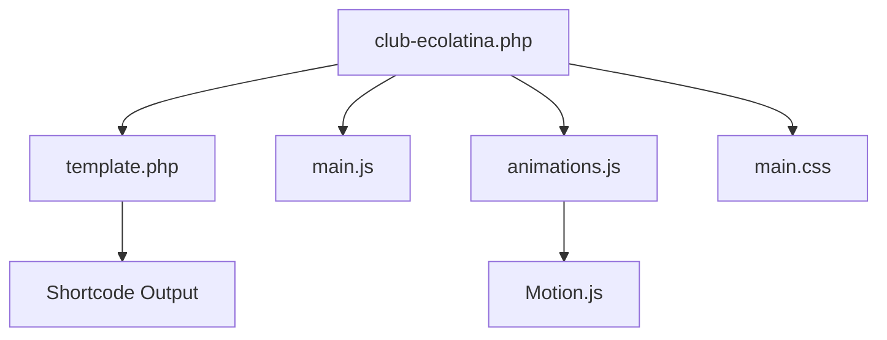

# System Patterns: Club Ecolatina WordPress Plugin

## Architecture Overview

### Plugin Structure

```
club-ecolatina/
├── club-ecolatina.php       # Main plugin file
├── includes/                # PHP includes
│   └── template.php         # Main template
├── assets/                  # Frontend assets
│   ├── css/
│   │   └── main.css
│   ├── js/
│   │   ├── animations.js
│   │   └── main.js
│   └── images/
│       ├── *.svg           # HUD elements
│       └── *.webp          # Computer images
```

## Key Technical Decisions

### 1. Animation System

-   Using Motion.js for animations
-   Global Motion object pattern
-   Scroll-based animation triggers
-   WordPress-aware scroll calculations

### 2. Asset Management

-   Local asset storage vs CDN
-   WordPress enqueue system
-   Proper dependency handling
-   Version control for cache busting

### 3. WordPress Integration

-   Shortcode-based implementation
-   Proper script/style enqueuing
-   Admin bar compatibility
-   Theme independence

### 4. Component Relationships



## Design Patterns

### 1. Script Loading

```javascript
// WordPress enqueue pattern
wp_enqueue_script('motion-js', 'URL', array(), 'VERSION', true);
wp_enqueue_script('animations', 'URL', array('motion-js'), 'VERSION', true);
```

### 2. Animation Pattern

```javascript
// Global Motion object usage
Motion.animate(
    element,
    {
        property: value,
    },
    {
        duration: time,
    }
);
```

### 3. WordPress Integration Pattern

```php
// Shortcode implementation
add_shortcode('club_ecolatina', 'render_club_ecolatina');
```

## Component Interactions

### 1. Animation Flow

1. Motion.js loads globally
2. animations.js uses global Motion object
3. Scroll events trigger animations
4. WordPress admin bar offset considered

### 2. Asset Loading Flow

1. WordPress enqueues scripts/styles
2. Dependencies resolved
3. Assets loaded in correct order
4. Local paths used via wp_localize_script

## Error Handling

### 1. Script Loading

-   Check for Motion.js presence
-   Fallback for animation failures
-   Element existence verification

### 2. WordPress Integration

-   Proper nonce verification
-   Capability checks
-   Asset loading verification

## Performance Considerations

### 1. Animation Performance

-   Debounced scroll events
-   RAF for smooth animations
-   Proper transform properties

### 2. Asset Loading

-   Minified resources
-   Proper async/defer usage
-   Cache control headers
